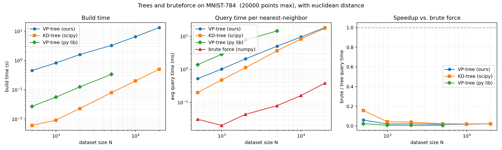

# VP-Tree: Nearest Neighbor Search in General Metric Spaces
This is for my *larp*

## About Vantage-Point Trees
This implementation is based on the paper *Data Structures and Algorithms for Nearest Neighbor Search in General Metric Spaces*, it's a fairly old paper from '92 but it contains an interesting data structure (the VP-Tree), that is based on basic concepts of metric spaces and topology, which I found interesting.

This data-structure is good for solving the *nearest neighbor problem* in highly dimensional euclidean settings or spaces where data can't be conveniently embedded. It's pretty self-evident to see how this is useful in machine learning.

The tree works similar to a *KD-Tree* in it's idea to partition the search space. Though it's form of partioning the space is based on the idea of a metric space $(X, d)$, where $d : X \mapsto [0,1]$, then for a particular element $p \in X$ which we call the *vantage-point*, we define the following functions with $a,b \in X$:

1. $\Pi_p : X \mapsto [0,1]$ is given by: $\Pi_p(a) = d(a,p)$

2. $d_p : X \times X \mapsto [0,1]$ is given by: $d_p(a,b) = |\Pi_p(a) - \Pi_p(b)| = |d(a,p) - d(b,p)|$

Note that $d_p$ is not a metric (can you think of a counter example? \:) ), since $d$ is a metric, then:
$d(a,b) \geq |d(a,p) - d(b,p)| = d_p(a,b)$.

The whole idea of defining the function is to "see" the space from $p$'s perspective (not that it has sentience), this way we can use the image of a dataset $\mathcal{S}_D$ under $\Pi_p$ to start partitioning the space using the median $\mu$ of the image (more details on the paper).

## Benchmarks

Well one thing we can see from the benchmarks is that Pypi's vptree SUCKS. Besides from that, it looks like kd-trees and vp-trees
get pretty *brutalized* by brute force (ba dum tss) In numerical instances (like the euclidean distance of vectors in this case), this is because BLAS and other numerical libraries are optimized by things like SIMD and lots of other hardware magic (the secret that PhDs hate!). 

So then VPTrees are useless and we should forget about them. But if you actually read the about section you'd know that VPTrees are not made to be performant on common spaces. They're useful in spaces that cannot be easily embedded, or where the intrinsic dimension is way lower than the extrinsic. For example the [Levenshtein distance](https://en.wikipedia.org/wiki/Levenshtein_distance) in genome sequences.

[Link to the dataset](https://www.kaggle.com/datasets/aadeshkoirala/mnist-784?resource=download)

## References
[1] Yianilos, P. N. (1993). Data structures and algorithms for nearest neighbor search in general metric spaces. In Proceedings of the Fourth Annual ACM-SIAM Symposium on Discrete Algorithms (SODA '93), pp. 311–321. Society for Industrial and Applied Mathematics. URL: https://dl.acm.org/doi/10.5555/313559.313789

